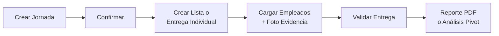

# Gestión de Beneficios (RRHH)

Módulo de Odoo para controlar la entrega de beneficios (ej. combos de alimentos) a los empleados, organizados por jornadas con evidencia fotográfica.

---

## Datos del Módulo

| Campo       | Valor                          |
|-------------|--------------------------------|
| Nombre Técnico | `hr_benefit`                |
| Versión     | 1.0                            |
| Autor       | CFuentesDev                    |
| Licencia    | LGPL-3                         |
| Dependencias| `base`, `hr`, `product`        |

---

## ¿Qué hace este módulo?

### Jornadas de Beneficios
Una jornada define **cuándo** y **qué** se entrega. Se configuran las fechas de vigencia, los productos del beneficio y los departamentos autorizados. Solo cuando la jornada está confirmada y dentro de las fechas, se pueden realizar entregas.

**Estados:** Borrador → Confirmado → Finalizado

### Listas de Entrega (entrega masiva)
Permiten entregar beneficios a muchos empleados a la vez:
1. Se seleccionan departamentos y se cargan los empleados automáticamente.
2. Se asigna un responsable del retiro y se toma foto como evidencia.
3. Se confirma y valida la entrega.

El sistema **impide que un empleado reciba el beneficio dos veces** en la misma jornada y genera un **número de referencia automático** para cada lista.

### Entregas Individuales
Para casos puntuales donde se entrega el beneficio a un solo empleado, con foto de evidencia obligatoria.

### Evidencia Fotográfica (Widget Webcam)
El módulo incluye un widget personalizado que permite:
- Capturar fotos directamente desde la cámara del dispositivo.
- Subir imágenes desde el sistema de archivos.
- Ver las fotos con zoom al hacer clic.

Se usa tanto para la foto del responsable de retiro como para la evidencia por empleado.

---

## Extensiones a Modelos de Odoo

### Empleados (`hr.employee`)
- **Tipo de Empleado:** clasificación como *Empleado* o *HP*.
- **Tipo de Identificación:** V, E, J o RIF.
- La cédula se muestra prominentemente en el formulario y solo acepta números.
- Búsqueda inteligente: al buscar empleados se puede escribir la cédula con o sin formato (ej. `V-12.345.678` encuentra `12345678`).

### Departamentos (`hr.department`)
- **Nivel Jerárquico:** Superior, Apoyo o Sustantivo.
- **Decorativo:** los departamentos decorativos son solo organizativos y no pueden tener empleados asignados directamente.

---

## Seguridad

| Rol           | Permisos                                        |
|---------------|--------------------------------------------------|
| **Usuario**   | Crea y ve solo sus propios registros             |
| **Administrador** | Acceso total a todos los registros          |

---

## Reportes

- **Relación de Entrega (PDF):** documento imprimible con la lista de empleados beneficiados, departamento, cantidad y espacio para firma.
- **Análisis Pivot:** vista interactiva para analizar entregas por jornada, departamento y empleado.

---

## Estructura del Menú

```
Beneficios
├── Gestión
│   ├── Jornadas
│   ├── Listas de Entrega
│   └── Entregas Individuales
└── Informes
    └── Análisis de Entregas
```

---

## Flujo de Trabajo Resumido



---

## Datos de Demostración

El módulo incluye un generador de datos demo (actualmente desactivado) que crea 5 departamentos principales con sub-departamentos y 200 empleados ficticios para pruebas.

---

## Instalación

1. Copiar `hr_benefit` en el directorio de addons de Odoo.
2. Reiniciar Odoo y actualizar la lista de aplicaciones.
3. Buscar **"Gestión de Beneficios"** e instalar.
